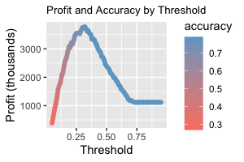

## Section 1: Executive Summary

This report provides an analysis and evaluation of loan profitability by predicting which loan applicants are likely to default on their loans in the future. The methods of analysis include logistic regression modeling and optimization for both accuracy and profit, and can be stepped through in the accompanying R Markdown file.   

From the performed analyses, this report concludes that the bank's profit can be optimized by:    

* Utilizing a logistic regression model that incorporates 23 out of 30 available variables, from loan term to the applicant's number of credit checks in the past six months;
* Setting a classification threshold of 32%, representing the probability that the applicant defaults on their loan; and
* Accepting loan applications from applicants below the threshold and denying applicants above the threshold.

The graph below shows how this criteria maximizes profit while maintaining accuracy:  


Compared to a model which accepts all loans, the profit is increased by 238%, and about 77% of all loan applications will be accepted The overall accuracy of this model is 75%, only 3% below a model optimized for accuracy rather than profit. Limitations include: missing data in certain variables that have consequently been left out of the model, but are logically accounted for by other variables.  

## Setup: Load Packages

```{r, message=FALSE}
library(ggplot2)
library(ggformula)
library(gridExtra)
library(dplyr)
library(tidyr)
library(readr)
library(knitr)
```

## Section 2: Introduction

Given a dataset containing information on 50,000 loans with 30 variables, the goal is to use logistic regression to predict which applicants are likely to default on their loans. I will do this by preparing and cleaning the dataset, exploring and transforming the data to eliminate skew, creating and optimizing a logistic model, and reporting my findings.

## Section 3: Preparing and Cleaning the Data

The goal of this section is to explore, clean, and prepare the data for further analysis. Here is a sample of what the original data looks like. It consists of 50000 rows x 32 columns.

```{r, echo=FALSE, message=FALSE, fig.height=4, fig.width==7}
# Load data and show head
data <- read_csv('https://datascienceuwl.github.io/Project2018/loans50k.csv')
knitr::kable(head(data[1:5, 1:8]), "simple")
```
  
Preparing the response variable `status` by filtering out loans that aren't "Fully Paid", "Charged Off", or "Default", and refactoring the column into two factors: "Good" and "Bad". 

```{r, echo=FALSE}
# Change status into response variable, filtering for Good and Bad loans, and changing to a factor
data <- data %>% mutate(status = case_when(
    status %in% c("Fully Paid") ~ "Good",
    status %in% c("Default", "Charged Off") ~ "Bad",
    TRUE ~ NA_character_
))
data <- data %>% tidyr::drop_na(status)
data$status <- factor(data$status,levels = c("Good", "Bad"))
```

Eliminating variables not useful as predictors from analysis: `loanID` is irrelevant to predicting loan payment; there are over 15,000 different titles and 1,918 `NA` values in `employment` which do not provide more information than income; `pubRec`, which is the number of derogatory public records, seems to be making a subjective judgment on what is termed "derogatory" and is unethical to use in this analysis.  

Removing redundant variables: `totalRevLim`, `totalIlLim`, and `totalBcLim` are all some subset or variation of `totalLim` in terms of total credit limits; `openAcc` is correlated with `totalAcc` with a correlation coefficient of 0.687, so it will also be removed.  

```{r}
data <- data %>% dplyr::select(!c('loanID', 'employment', 'pubRec', 
                                  'totalRevLim', 'totalIlLim', 
                                  'totalBcLim', 'openAcc'))
```


```{r, echo=FALSE}
# Converting variables to factors when appropriate
data$length <- factor(data$length,levels = c("< 1 year", "1 year", "2 years", 
                                             "3 years", "4 years", "5 years",
                                             "6 years", "7 years", "8 years", 
                                             "9 years", "10+ years", "n/a"))
data$term <- factor(data$term)
data$grade <- factor(data$grade, levels = c("A", "B", "C", "D", "E", "F", "G"))
data$home <- factor(data$home)

# Verified and Source Verified indistinguishable, will combine into one category and into factor column
data$verified <- sub("Source Verified", "Verified", data$verified)
data$verified <- factor(data$verified)

# Lumping 'wedding' and 'renewable_energy' with 'other' for `reason` for loan, lumping few cases together
wedding_count <- sum(data$reason=="wedding")
renewable_energy_count <- sum(data$reason=="renewable_energy")
data$reason <- sub("wedding", "other", data$reason)
data$reason <- sub("renewable_energy", "other", data$reason)
data$reason <- factor(data$reason)
```
Converting categorical variables to factors when appropriate and lumping small or indistinguishable categories together. "Source Verified" and "Verified" combined as categories in `verified`. "wedding" and "renewable_energy" lumped into "other" in `reason` as they have such small counts (`r wedding_count` and `r renewable_energy_count`, respectively).  

```{r, echo=FALSE}
missing_vals <- sum(is.na(data))
bcRatio_nas <- sum(is.na(data$bcRatio))
bcOpen_nas <- sum(is.na(data$bcOpen))
revolRatio_nas <- sum(is.na(data$revolRatio))
```

There are `r missing_vals` missing values in the dataset, `r bcRatio_nas` in `bcRatio`, `r bcOpen_nas` in `bcOpen`, and only `r revolRatio_nas` in `revolRatio`. As these `NA`s all overlap, the rows with missing values make up only `r round(max(bcRatio_nas, bcOpen_nas, revolRatio_nas)/dim(data)[1]*100, 2)`% of the dataset. Removing these rows with missing values makes more sense than potentially biasing the analysis by imputing values.  

Additionally, there are 1796 "n/a"s in `length`. This is a large number of rows, so we would not automatically exclude them. Looking at a barchart of `length` by `status`, the distribution of "Good" and "Bad" loans is similar in "n/a" to most other categories, so we will include the "n/a"s in our analysis, along the lines of an "other" category. 

```{r}
data <- data %>% tidyr::drop_na(revolRatio) %>% 
  tidyr::drop_na(bcOpen) %>% 
  tidyr::drop_na(bcRatio)
```

## Section 4: Exploring and Transforming the Data

The purpose of this section is to explore and transform the dataset to prepare for the model. This involves creating graphs and visualizations of the data and variables.  

The quantitative predictor variables are almost all right skewed, to varying degrees. The strongest skew is in `income` and `avgBal`. The next strongest skewed are `totalBal`, `totalLim`, and `totalRevBal`. The other variables with right skew that need transformation are `accOpen24` and `totalAcc`. The following transformations were applied in order to give the variable distributions a more normal shape and so that extreme values will have less influence on the model: logarithm to the most skewed, cube root the the next tier, and square root to the last tier.  

Examples from each tier of skewness, and how they were transformed:  
```{r, echo=TRUE, dpi=300, fig.width=7, fig.height=7}
# Log transformation
h1 <- ggplot(data, aes(x=income)) + 
  geom_histogram(bins=25, fill="thistle3") +
  labs(x="Income")
h2 <- ggplot(data, aes(x=log(income))) + 
  geom_histogram(bins=25, fill="thistle3", size=.5) +
  labs(x="Log of Income")
# Cube root transformation
h3 <- ggplot(data, aes(x=totalLim)) + 
  geom_histogram(bins=25, fill="skyblue3") +
  labs(x="Credit Limit")
h4 <- ggplot(data, aes(x=totalLim**(1/3))) + 
  geom_histogram(bins=25, fill="skyblue3") +
  labs(x="Cube Root of Credit Limit")
# Square root transformation
h5 <- ggplot(data, aes(x=totalAcc)) + 
  geom_histogram(bins=25, fill="salmon") +
  labs(x="Total Accounts")
h6 <- ggplot(data, aes(x=sqrt(totalAcc))) + 
  geom_histogram(bins=25, fill="salmon") +
  labs(x="Square Root of Total Accounts")
grid.arrange(h1, h2, h3, h4, h5, h6, nrow=3,
             top="Example Transformations for Skewed Variables")
```

```{r, eval=FALSE, echo=FALSE}
# Making histograms of quantitative variables to look for skew
par(mfrow=c(2,2))
hist(data$amount) # mild right skew
hist(data$rate) # mild right skew
hist(data$payment) # mild right skew
hist(data$income) # extreme right skew
```

```{r, eval=FALSE, echo=FALSE}
# Even more skew histograms
par(mfrow=c(2,2))
hist(data$debtIncRat)
hist(data$accOpen24) # right skew
# revolRatio mound shaped
hist(data$totalAcc) # right skew
hist(data$revolRatio)
```

```{r, eval=FALSE, echo=FALSE}
# Even more histograms!
par(mfrow=c(2,2))
hist(data$totalBal) # right skew
hist(data$avgBal) # strong right skew
hist(data$totalLim) # right skew
hist(data$totalRevBal) # right skew
```

```{r,echo=FALSE}
# Transform the data
data$income = log(data$income)
data$avgBal = (data$avgBal)**(1/3)

data$totalBal = (data$totalBal)**(1/3)
data$totalLim = (data$totalLim)**(1/3)
data$totalRevBal = (data$totalRevBal)**(1/3)

data$accOpen24 = sqrt(data$accOpen24)
data$totalAcc = sqrt(data$totalAcc)
```

Selection of quantitative predictor variables with noticeable variations in their distributions by loan status:  
```{r, echo=FALSE, dpi=300, fig.width=6, fig.height=3.5}
# The quantitative predictor values I found with the strongest relationships with loan status
p1 <- ggplot(data, aes(x=rate, fill=status)) + 
  geom_histogram(aes(y=..density..), alpha=0.5, position="identity", bins=25) +
  labs(x="Loan Rate") + 
  scale_fill_manual(values=c("skyblue3", "salmon"))
p2 <- ggplot(data, aes(x=accOpen24, color=status)) +
  geom_density() +
  labs(x="Accounts Opened Past 24 Months") +
  scale_color_manual(values=c("skyblue3", "salmon"))
p3 <- ggplot(data=data, aes(y=debtIncRat, x=status, fill=status)) +
  geom_boxplot() +
  labs(x="Monthly Debt Payment to Income") + 
  scale_fill_manual(values=c("skyblue3", "salmon"))
p4 <- ggplot(data, aes(x=revolRatio, color=status)) +
  geom_density() +
  labs(x="Proportion of Revoling Credit in Use") +
  scale_color_manual(values=c("skyblue3", "salmon"))
grid.arrange(p1, p2, p3, p4, nrow=2,
             top="Relationships Between Quantitative Predictors and Loan Status")
```

Selection of categorical predictor variables with noticeable variations in their distributions by loan status:
```{r, echo=FALSE, dpi=300, fig.width=6, fig.height=4.5}
# Now to explore categorical predictors
c1 <- ggplot(data=data, aes(x=factor(term), fill=status)) +
  geom_bar(position=position_dodge()) +
  labs(x="Loan Status by Term") + 
  scale_fill_manual(values=c("skyblue3", "salmon"))
c2 <- ggplot(data=data, aes(x=factor(length), fill=status)) +
  geom_bar() +
  labs(x="Loan Status by Length of Continuous Employment") +
  theme(axis.text.x=element_text(angle=90, hjust=1, vjust=0)) + 
  scale_fill_manual(values=c("skyblue3", "salmon"))
c3 <- ggplot(data=data, aes(x=factor(grade), fill=status)) +
  geom_bar() +
  labs(x="Loan Status by Grade") + 
  scale_fill_manual(values=c("skyblue3", "salmon"))
c4 <- ggplot(data=data, aes(x=factor(home), fill=status)) +
  geom_bar(position=position_dodge()) +
  labs(x="Loan Status by Homeownership") + 
  scale_fill_manual(values=c("skyblue3", "salmon"))
c5 <- ggplot(data=data, aes(x=factor(verified), fill=status)) +
  geom_bar(position=position_dodge()) +
  labs(x="Loan Status by Income Verification") + 
  scale_fill_manual(values=c("skyblue3", "salmon"))
c6 <- ggplot(data=data, aes(x=factor(reason), fill=status)) +
  geom_bar() +
  labs(x="Loan Status by Reason") +
  theme(axis.text.x=element_text(angle=90, hjust=1, vjust=0)) + 
  scale_fill_manual(values=c("skyblue3", "salmon"))
c7 <- ggplot(data=data, aes(x=factor(state), fill=status)) +
  geom_bar() +
  labs(x="Loan Status by State") + 
  scale_fill_manual(values=c("skyblue3", "salmon"))

grid.arrange(c1, c2, c3, c6, ncol=2,
             top="Relationships Between Categorical Predictors and Loan Status")
```

Of the quantitative predictors, `rate` has the strongest variation in behavior between "Good" and "Bad" loans. The categorical predictors have more obvious disparities between loan status. Specifically, the length of the loan `term` shows more "Good" loans at the 36 months level than at the 60 months level. Additionally, a continuous `length` of employment of 10+ years appears to be a good predictor of a "Good" loan.

## Section 5: The Logistic Model

Creating two datasets, `train` and `test`, from the cleaned and prepared data using `sample` to randomly select 80% of the cases for `train` and the other 20% for `test`. Building logistic regression model from the `train` data, leaving out `totalPaid`, but including all other remaining variables as predictors. 

```{r}
set.seed(42)
 
sample_size = round(nrow(data)*.80)
index <- sample(seq(nrow(data)), size = sample_size)
 
train <- data[index, ]
test <- data[-index, ]

# Dropping 'totalPaid' from train data
train <- train %>% dplyr::select(!'totalPaid')

# Creating logistic regression model
model <- glm(status ~ ., data = train, family = 'binomial')
```

Using the test dataset along with the `model` and `predict()` to generate predicted statuses for each loan and to analyze the performance (accuracy) of the model. With the default threshold of 0.5 to classify the “Good” and “Bad” loans, creating a confusion matrix and determining the overall accuracy of the model (the percentage of correctly predicted outcomes), the percentage of actually good loans that are predicted as good, and the percentage of actually bad loans that are predicted as bad.

```{r, echo=FALSE}
pred_prob <- predict(model, test, type = 'response')
threshold <- 0.5
pred_status <- cut(pred_prob, breaks=c(-Inf, threshold, Inf), 
                labels=c("Good=0", "Bad=1"))  # Y=1 is "Bad" here
cTab <- table(test$status, pred_status) %>%
  addmargins()
# compute the proportion of correct classifications
p_all <- (cTab[1,1] + cTab[2,2]) / cTab[3,3]
p_good <- (cTab[1,1] / cTab[3,1])
p_bad <- (cTab[2,2] / cTab[3,2])

knitr::kable(cTab, 'simple')
```
  
  
**Overall accuracy: `r round(p_all,4)`**  
**Good loan accuracy: `r round(p_good,4)`**  
**Bad loan accuracy: `r round(p_bad,4)`**  
  
This model has an overall accuracy of `r round(p_all*100, 2)`%, which means that greater than 3/4 loans will be correctly classified as "Good" or "Bad". This model is effective as compared to a strategy which might only correctly classify 50% of loans, or another strategy than simply accepts all loans. However, this model's accuracy can be improved by varying the threshold it uses to classify a loan, which will be explored in the next section.

## Section 6: Optimizing the Threshold for Accuracy

This section will investigate how changing the threshold affects the model predictions, and accuracy, when applied to the test data.    

Experimenting with the classification threshold to change the proportions of loans that are predicted as good and bad. 
  
  
```{r, echo=TRUE}
thresholds <- seq(.25, .7, .01)
# Creating empty vectors to hold accuracies from different thresholds
acc.good <- c()
acc.bad <- c()
acc.all <- c()
for (val in thresholds) {
  pred_status <- cut(pred_prob, breaks=c(-Inf, val, Inf), 
                labels=c("Good=0", "Bad=1"))  # Y=1 is "Bad" here
  cTab <- table(test$status, pred_status) 
  cTab <- addmargins(cTab)

  good <- cTab[1,1] / cTab[3,1]
  bad <- cTab[2,2] / cTab[3,2]
  all <- (cTab[1,1] + cTab[2,2]) / cTab[3,3]
  # Store values
  acc.good <- c(acc.good, good)
  acc.bad <- c(acc.bad, bad)
  acc.all <- c(acc.all, all)
  }

acc.df <- data.frame(thresholds, acc.good, acc.bad, acc.all)
threshold_max_accuracy <- acc.df$thresholds[which.max(acc.df$acc.all)]
```
The table and plot below demonstrate how the proportion of loans correctly predicted varies.  

```{r, echo=FALSE}
knitr::kable(head(acc.df), "simple", caption = "Proportion of loans correctly predicted (51 x 4)")
```

```{r, echo=FALSE, message=FALSE, dpi=300, fig.width=7, fig.height=5}
# data into stacked format
acc.df.tall <- acc.df %>%
  pivot_longer(cols = c(acc.good, acc.bad, acc.all)) %>%
  rename(accuracy = value,
         threshold = thresholds,
         loan_type = name)

# plot
ggplot(data = acc.df.tall, aes(x=threshold, y=accuracy, color=loan_type)) +
  geom_point(size = .5) +
  stat_smooth(geom='line', method='gam', alpha=0.8, se=FALSE) +
  scale_color_manual(labels = c('All', 'Bad', 'Good'), values=c("darkmagenta", "salmon", "skyblue3")) +
  ggtitle('Accuracy v. Threshold') +
  labs(color = 'Loan Type') +
  geom_vline(xintercept = .54, size=.5) +
  geom_vline(xintercept = .63, linetype="dashed", 
                size=.5) +
  annotate("segment", x = .72, xend=.67, y = .85, yend = .85, 
           colour = "black", size = .5, alpha=.7, arrow=arrow(length = unit(0.1, "in"))) +
  annotate("segment", x = .67, xend=.67, y = .83, yend = .87, 
           colour = "black", size = .5, alpha=.5)
```

The maximum overall accuracy of the model on the test data is achieved at a `r threshold_max_accuracy` threshold. "Good" loans are predicted the most accurately at lower thresholds, whereas "Bad" loans are better predicted at the higher thresholds. However, the best overall accuracy is not at the threshold where the two lines meet, shown by the dashed black line on the plot. Instead, the most accurate threshold is slightly left, shown by the solid black line, because the majority of the loans are "Good" loans, as can be seen in the confusion matrix above. 

Note on the plot: Higher thresholds mean that less loans are classified as "Bad". What this means is that for thresholds over 0.67, the number of loans classified as "Bad" is very small (< 20 out of 6854). The arrow on the plot demonstrates the point where "Bad" loan accuracy starts to fall, but this is due to the small number of observations rather than a true decrease in accuracy. It can generally be assumed that "Bad" loan accuracy will increase at higher thresholds.


## Section 7: Optimizing the Threshold for Profit

Repeating the threshold analysis of the previous section to find the value of the threshold that maximizes the profit. Applying the model to the test data and assuming the bank denies all of the loans that the model predicts as “Bad”. 

```{r, echo=FALSE, message=FALSE, dpi=300, fig.width=7, fig.height=5}
threshold_profit <- seq(.05, .95, .01)

profits <- c()
for (val in threshold_profit) { # Good=0, Bad=1
  new_profit <- sum(test$totalPaid[pred_prob < val] - test$amount[pred_prob < val]) 
  profits <- c(profits, new_profit)
}
profit.df <- data.frame(threshold_profit, profits)

max_profit <- max(profit.df$profits)
threshold_max_profit <- profit.df$threshold_profit[which.max(profit.df$profits)]

# Percent increase in profits
profit.df <- profit.df %>%
  mutate(no_model_profit = sum(test$totalPaid - test$amount),
         percent_increase = 100*((profits / no_model_profit)-1))

max_percent_increase_profit <- max(profit.df$percent_increase)

perfect_model_profit <- sum(test$totalPaid[test$status == 'Good'] - test$amount[test$status == 'Good'])
perfect_percent_increase_profit <- 100*((perfect_model_profit / sum(test$totalPaid - test$amount))-1)

# Accuracies
profit_model_acc_overall <- acc.df[which(acc.df$thresholds == threshold_max_profit),]$acc.all
profit_model_acc_bad <- acc.df[which(acc.df$thresholds == threshold_max_profit),]$acc.bad
profit_model_acc_good <- acc.df[which(acc.df$thresholds == threshold_max_profit),]$acc.good

# plot
ggplot(data = profit.df, aes(x=threshold_profit, y=profits/1000)) +
  geom_point(color='seagreen', size=1) +
  stat_smooth(geom='line', method='gam', se=FALSE, color='seagreen', alpha=.8) +
  ylab('Profit (thousands)') +
  xlab('Threshold') +
  ggtitle('Profit v. Threshold') +
  geom_hline(yintercept = max_profit/1000, size = .5) +
  geom_hline(yintercept=1118388.8/1000, linetype="dashed", 
                size=.5)

```

The total profit increases and then peaks at a threshold of `r threshold_max_profit` and profits of `r dollar(max_profit)` (shown as a solid black line), before declining and eventually plateauing after a threshold of 0.76 and profits of $1,118,388.80, which is the same total profit a bank would make by accepting all loans (shown as a dashed black line).  

The maximum percentage increase in profit that can be expected by deploying the model is `r round(max_percent_increase_profit,2)`%. Compared to the increase in profit from a perfect model that denies all of the truly bad loans, a `r round(perfect_percent_increase_profit,2)`% increase, the perfect model would be a greater than 4x increase profit from our model.  

For our model's best profit threshold, the overall accuracy is `r round(100*profit_model_acc_overall,2)`%; `r round(100*profit_model_acc_good,2)`% of "Good" loans are correctly predicted, and `r round(100*profit_model_acc_bad,2)`% of "Bad" loans. The maximum profit threshold does not coincide with the maximum accuracy threshold, `r threshold_max_profit` and `r threshold_max_accuracy`, respectively.

## Section 8: Results Summary

The final classification model I suggest to the bank is based on maximizing profit rather than accuracy. With this assumption, the classification threshold to use is `r threshold_max_profit`, where 0="Good" and 1="Bad" for loan status. This model is based on the predictor variables: `amount, term, rate, payment, grade, length, home, income, verified, reason, state, debtIncRat, delinq2yr, inq6mth, revolRatio, totalAcc, totalBal, accOpen24, avgBal, bcOpen, bcRatio, totalLim, totalRevBal.`  

```{r, echo=FALSE, message=FALSE, dpi=300, fig.width=7, fig.height=5}
acc.all.profits <- c()
for (val in threshold_profit) {
  pred_status <- cut(pred_prob, breaks=c(-Inf, val, Inf), 
                labels=c("Good=0", "Bad=1"))  # Y=1 is "Bad" here
  cTab <- table(test$status, pred_status) 
  cTab <- addmargins(cTab)
  
  all <- (cTab[1,1] + cTab[2,2]) / cTab[3,3]
  # Store values
  acc.all.profits <- c(acc.all.profits, all)
  }
acc_profit.df <- profit.df %>%
  mutate(accuracy = acc.all.profits) %>%
  select(threshold_profit, profits, accuracy)

ggplot(data = acc_profit.df, aes(x=threshold_profit, y=profits/1000, color=accuracy)) + 
  geom_line(size=2, lineend = "round") +
  xlab('Threshold') +
  ylab('Profit (thousands)') +
  ggtitle('Profit and Accuracy by Threshold') +
  scale_color_gradient(low = "salmon", high = "skyblue3")

```

As the plot shows, there is certainly a tradeoff between accuracy and profit, but at the threshold for maximizing profit, the accuracy is still quite high. The overall profit of this model, based on the test data, is `r dollar(max_profit)`. The overall accuracy is `r round(100*profit_model_acc_overall,2)`%, the percent of "Good" loans correctly predicted is `r round(100*profit_model_acc_good,2)`%, and the percent of "Bad" loans correctly predicted is `r round(100*profit_model_acc_bad,2)`%.
